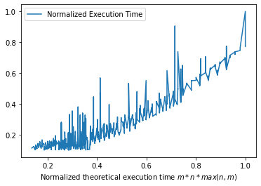

# PA 1

#### Algorithms 1 - Pedro Tavares de Carvalho

The assignment at hand was called **The Jump Game** (O Jogo do Pulo), and it was a board game of $$k$$ players, all split in a bidimentional board of dimensions $$M\times N$$, whose tiles contain a positive integer number, which dictates the number of steps in [manhattan directions]([https://xlinux.nist.gov/dads/HTML/manhattanDistance.html#:~:text=Definition%3A%20The%20distance%20between%20two,y1%20%2D%20y2%7C.&text=Lm%20distance.](https://xlinux.nist.gov/dads/HTML/manhattanDistance.html#:~:text=Definition%3A The distance between two,y1 - y2|.&text=Lm distance.)) (in $x$ or $y$ directions) will be taken when jumping from the tile (not less and not more). The rules of the game were:

- Players start in a previously given position and playing order
- The game is then played in turns. The first turn's order is dictated by the starting order and each subsequent turn is then determined by the lesser number in the player's chosen tile. 
  - In case of a tie in priority, the player with the most priority in the previous turn keeps the priority.
- The game is played until either:
  - A player wins, which means the player get's to the $$(M-1,\: N-1)$$ position.
    - A tie is decided by the priority when getting to the last tile. 
  - No player can make any moves.

The objective of the assignment is to design an algorithm to determine the winner of any given game and the number of turns it takes for that player to win (or if there can't be a winner), considering all players play optimally.

## The algorithm design

The first step is to try and model the problem in a more approachable way. To model it, you can think of it as a search problem in a graph. Let's say you start on a given position $$(x,\: y)$$. If you can jump $S$ steps from this position, you can get to any square that takes this number of steps from that tile. 

Given that you can jump back and forth, you can get to any tile that takes less than $S$ steps, given that the distance to the tile has the same parity as $S$. You can think of it as if you got to a a tile $X$, if the number of steps you still need to take is even, you can keep jumping back and forth between a neighbor tile, and you will end up in the $X$ tile. So, given a tile $(x,\:y)$, you can get to any tile $(x+i,\:y+j)$, as long as $i+j \le S$ and $S = i+j\mod 2$.

From this, we can build an adaptation of a best first search algorithm (described below) to find the solution to the problem.

```pseudocode
def BreadthFirstSearch(goal, initial node, nodes):
	Set all nodes to "not visited";

	q = new Queue()

	q.enqueue(initial node)

	while q ≠ empty:
		x = q.dequeue()
		if x == goal:
			return x
		if x has not been visited:
		
			visited[x] = true         // Visit node x !

			for every edge (x, y) :    
				if ( y has not been visited ):   
					q.enqueue(y)       
```

To adapt this code, the idea is to consider two more variables:

- The current player's priority
- The current node's turn

Besides that, we need to add more initial nodes to the queue, to represent each given player, and create an algorithm to get the edges in the way described beforehand.

```pseudocode
def GetEdges(nodes, node):
	accessible = []
	max_distance = node.reach
	for i, j in distances that are within max_distance of node:
		if i + j % 2 == max_distance % 2:
			accessible.append((node.x + i, node.y + j))
	return accessible
```

From this, we can adapt the BFS algorithm so that it fits our needs:

```pseudocode
def GetGameWinner(board, players):
	set all node.round in board to -1
	set all node.previous in board to null
	
	edge = new Queue()
	
	for player in players:
		board[player.position].round = 0
		board[player.position].player = player
		edge.enqueue(player.position)
	
	while edge != empty:
		x = edge.dequeue()
		if x == (board.width - 1, board.height - 1):
			return board[x].player, board[x].round 
		for node in GetEdges(board, node):
			if board[node].round == -1 or // if the node hasn't been visited
				(board[node].round > board[x].round // or if the node has been visited
													// by a node with lesser priority
													// then the current node
					and 
                 board[node].previous.max_distance > board[x].previous.max_distance):
                 
                // consider then that the node was reached from this node, by the player
                // that reached the current node
				board[node].round = board[x].round + 1 	// this makes so that the node 
														// contains the number of rounds
														// it took to get to it
														
				board[node].player = board[x].player	// and this sets the player to
														// the node that
				board[node].previous = board[x]
				if board[node].round == -1:
					edge.enqueue(node)
```

This algorithm guarantees that every move that is played is played by the player with the most priority to make that move, and it guarantees that if the target can be seen, it will be seen and reached in the optimal manner.

It also preserves the number of moves that were taken to get to the objective, and stops early whenever the objective is reached.

The *queue* is used as a data structure that maintains the correct order of node exploration, and it also has $O(1)$ complexity for insertion and access.

### Proof of correctness

> The algorithm always reaches the goal when the goal is reachable.

#### Proof by contradiction

Let's assume that the goal is reachable and has not been reached. This would imply that the algorithm stopped before every reachable node is reached, which is a contradiction in itself, since every node that is explored is expanded, and the nodes reachable from it are also explored.

> The algorithm always gives the correct winner

#### Proof by contradiction

Assuming a player $x$ should have won, but didn't. This would imply that the algorithm did not explore a possibility where $x$ would have won, or if it did, it ignored the possibility. That can only be true if either the player would have taken more moves to reach the same tile as another player, or that the player that reached the goal had higher priority than $x$, which would imply that $x$ did not win, reaching a contradiction.

> The algorithm always gives the correct number of rounds taken by the winner

#### Proof by construction

Given a player $x$, whenever this player makes a move, the player took $c + 1$ moves to reach the next step, being $c$ the number of moves taken by $x$ until that point, starting on $0$. The algorithm, whenever a move is taken by the player, increases the number of moves that the player took to get to the next step by one, constructing the same flow as the actual action.

### Complexity analysis

The algorithm is divided into two main steps:

- Discovering reachable nodes
- Exploring nodes

No node is explored twice, so the maximum number of explored nodes is $M\times N$, which gives the *exploration* a complexity of $O(M\times N)$. For each exploration the discovery of reachable nodes takes $D^2$ steps, where $D$ is the maximum distance reachable from the node. $D$ is bounded by the size of the board, which is $(M\times N)$, so $D$ is bounded by $max(M, N)^2$, and there are $O(M\times N)$ explorations made in the algorithm, there fore the complete algorithm is $O(M\times N \times max(M,N)^2)$.

The space complexity is bounded by the number of nodes there are in the board, since no new node is created. This means that the space complexity is $O(M\times N)$.

## Experimental evaluation

To evaluate the code, I created several random boards, with the theoretical worst case performance (and took out the early stopping when reaching the goal). 



This plot represents the actual execution time of the algorithm vs it's theoretical execution time. Although pretty noisy, it's clear to see that there's a linear relationship between the two of them. The noise is probably my computer taking some time to get it together, since my RAM has been not the best lately. 